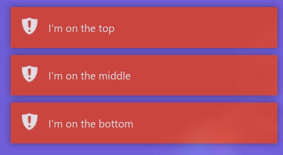

# Toasteur.js

Create beautiful and customizable toast nitifications 💬 for your website ✨ - Similar to toastr.js but don't need jQuery ❌


# Example

[A simple example of the usage of the library](https://skwalexe.github.io/Toasteur.js/example.html) is provided in this repository.

# JsDelivr 

```html
<script src="https://cdn.jsdelivr.net/gh/SkwalExe/Toasteur.js@v0.4.0/dist/toasteur.min.js"></script>
```

# NPM module 

Install the npm module 

```bash
npm install toasteur
```

And import it in your project 

```js
const Toasteur = require('toasteur');

let myToasteur = new Toasteur("top-right");
```

**⚠️ You will need to bundle the package with your application (for example with browserify) because this library only works in the browser**

```bash
browserify index.js -o bundle.js
```

# Setting up 

You can import the library into you website with [JsDelivr](#JsDelivr) or, you can use the [npm module](#NPM-module) and import it in your project.

**You also need to import the css file to your website** 

```html
<link rel="stylesheet" href="https://cdn.jsdelivr.net/npm/toasteur@0.4.0/dist/themes/toasteur-default.min.css">
```

# Your first toasts 🍞

## Changing the default position

```js
let myToasteur = new Toasteur("bottom-left"); // top-right by default
```

Accepted values are:

- top-left
- top-right
- bottom-left
- bottom-right
- top-center
- bottom-center

## Changing the default duration

```js
let myToasteur = new Toasteur("bottom-left", 5000); 
// 5000 by default
```

The notification will be displayed for 5 seconds

## Putting notifications on the top/bottom of the pile

You can choose to put the new notifications on the top or bottom of the pile.

```js
let myToasteur = new Toasteur("bottom-left", 5000, "top");
// can be "top" or "bottom"                        ^^^^
```



## Creating a toast notification

To create toast notifications, you can use the following methods:

- **success**: `myToasteur.success()`
- **error**: `myToasteur.error()`
- **warning**: `myToasteur.warn()`
- **info**: `myToasteur.info()`

This functions can take 3 arguments, the first one is required :
- The message to display
- The title of the message (optional)
- Callback when the toast is clicked (optional)

### Success ✅

```js
myToasteur.success("This is a success message, click me!", "Success!", () => {
    console.log("Clicked!");
});
```


### Errors ⛔

```js
myToasteur.error("This is an error, click me!", "Error!", () => {
   console.log("Clicked!")
});
```


### Warning ⚠️

```js
myToasteur.warn("This is a warning, click me!", "Warning!", () => {
    console.log("Clicked!");
});
```


### Info ℹ️

```js
myToasteur.info("This is an info, click me!", "Info!", () => {
    console.log("Clicked!");
});
```


# Why toasteur.js?

I wanted to add toast notifications to one of my websites, then I remembered the ones I saw on [HackTheBox](https://hackthebox.com), so I went there looking for the name of the library that they used, and I found it.

It was [Toastr.js](https://github.com/CodeSeven/toastr), I added the library to my website, and tried to create my first toast notification.

And BOOM, nothing happened. I went in the console, and I found this error:

```
Uncaught ReferenceError: $ is not defined
```

It was after 10 seconds of reading the documentation that I realized that this library required jQuery.
 
For technical reasons I couldn't add jQuery to my website, but I really liked the style of Toastr.js, and I didn't found anything similar on the web.

So I decided to create my own toast notification library.

I named it Toasteur.js, because I wanted to make it similar to Toastr.js and because I'm french 🇫🇷 and in french `Toaster` is written `Toasteur`.

# final

If you have any problem, don't hesitate to open an issue

# Contributing 💪

1. Start by [**forking** this repository](https://github.com/SkwalExe/Toasteur.js/fork)

2. Then clone your fork to your local machine.
  ```git
  git clone https://github.com/your-username/Toasteur.js.git
  ```

3. Install dev dependencies
```npm
npm install --save-dev
```

4. Create a new branch
  ```git
  git checkout -b super-cool-feature
  ```

5. Then make your changes

6. Update the changelog and version number if needed (using [Semantic Versioning](https://semver.org)) also, update the version number in the JsDelivr links (js and css)
  ```bash
  # bug fix
  npm version patch --no-git-tag-version

  # add a new feature 
  npm version minor --no-git-tag-version
  
  # changes that break backwards compatibility
  npm version major --no-git-tag-version
  ```

7. List and correct linting errors
  ```bash
  npm run lint
  ```

8. Update the minified/browser version of the library
  ```bash
  npm run build
  ```


9. Once you're done, commit your changes and push them to the remote repository.
  ```git
  git add --all
  git commit -m "Add super-cool-feature"
  git push origin super-cool-feature
  ```

10. Then, open a pull request on GitHub from your fork.
    1. Go to [this link](https://github.com/SkwalExe/Toasteur.js/compare/)
    2. Click compare across forks
    3. On the right, on `head repository` select your fork
    4. And on `compare` select the branch you just created
    5. Click on `Create Pull Request` and submit your pull request

<a href="https://github.com/SkwalExe#ukraine"></a>